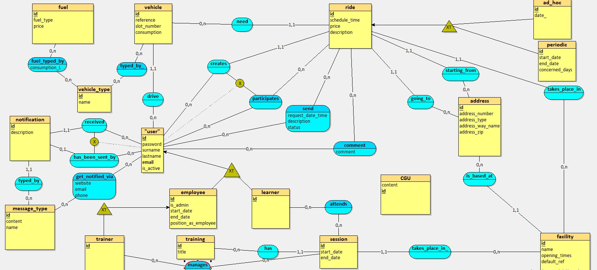
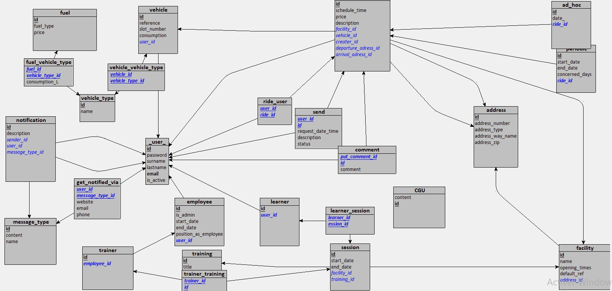

# Carshare

## Dictionnaire de données

[lien vers le dictionnaire de données](datas_library.csv)

|Table             |Code                |Libellé                                                                   |Type         |Contraintes      |
|------------------|--------------------|--------------------------------------------------------------------------|-------------|-----------------|
|_user_            |id                  |identifiant de l'utilisateur                                              |uuid         |primary, not null|
|_user_            |password            |mot de passe                                                              |VARCHAR(250) |not null         |
|_user_            |surname             |prénom                                                                    |VARCHAR(50)  |not null         |
|_user_            |lastname            |nom                                                                       |VARCHAR(250) |not null         |
|_user_            |email               |email                                                                     |VARCHAR(250) |not null, unique |
|_user_            |is_active           |Est-ce que le compte est active                                           |BOOLEAN      |not null         |
|learner           |id                  |identifiant de l'apprenant                                                |uuid         |primary, not null|
|employee          |id                  |identifiant de l'employé                                                  |uuid         |primary, not null|
|employee          |is_admin            |Est-ce que l'employée est un admin                                        |BOOLEAN      |not null         |
|employee          |start_date          |date de début du contrat                                                  |DATE         |not null         |
|employee          |end_date            |date de fin du contrat (si CDD)                                           |DATE         |                 |
|employee          |position_as_employee|Role dans l'entreprise                                                    |VARCHAR(50)  |not null         |
|training          |id                  |identifiant de la formation                                               |uuid         |primary, not null|
|training          |title               |Titre de la formation                                                     |VARCHAR(250) |not null         |
|vehicle           |id                  |identifiant du véhicule                                                   |uuid         |primary, not null|
|vehicle           |reference           |modèle du véhicule                                                        |VARCHAR(250) |not null         |
|vehicle           |slot_number         |nombre de places                                                          |INTEGER      |not null         |
|vehicle           |consumption         |consommation (en euros)                                                   |NUMERIC(15,2)|not null         |
|address           |id                  |identifiant de l'addresse                                                 |uuid         |primary, not null|
|address           |address_number      |numéro de voie                                                            |VARCHAR(50)  |not null         |
|address           |address_type        |type de voie                                                              |VARCHAR(50)  |not null         |
|address           |address_way_name    |nom de la voie                                                            |VARCHAR(50)  |not null         |
|address           |address_zip         |code postal                                                               |VARCHAR(5)   |not null         |
|facility          |id                  |identifiant du centre                                                     |uuid         |primary, not null|
|facility          |name                |nom du centre                                                             |VARCHAR(50)  |not null         |
|facility          |opening_times       |horaires                                                                  |json         |not null         |
|facility          |default_ref         |Est-ce que c'est le centre à défaut                                       |BOOLEAN      |not null         |
|fuel              |id                  |identifiant du carburant                                                  |uuid         |primary, not null|
|fuel              |fuel_type           |type de carburant                                                         |VARCHAR(50)  |not null         |
|fuel              |price               |prix du carburant                                                         |NUMERIC(15,2)|not null         |
|vehicle_type      |id                  |identifiant du type de vehicule                                           |uuid         |primary, not null|
|vehicle_type      |name                |nom du type de céhicule                                                   |VARCHAR(50)  |not null         |
|message_type      |id                  |identifiant de message                                                    |uuid         |primary, not null|
|message_type      |content             |message préfait                                                           |TEXT         |not null         |
|message_type      |name                |nom du type de message                                                    |VARCHAR(50)  |not null         |
|CGU               |id                  |identifiant des conditions générales d'utilisation                        |uuid         |primary, not null|
|CGU               |content             |texte des CGU                                                             |TEXT         |not null         |
|trainer           |id                  |identifiant du formateur                                                  |uuid         |primary, not null|
|ride              |id                  |identifiant du trajet                                                     |uuid         |primary, not null|
|ride              |schedule_time       |horaire                                                                   |TIME         |not null         |
|ride              |price               |prix de la course                                                         |NUMERIC(15,2)|not null         |
|ride              |description         |description (optionnelle)                                                 |TEXT         |                 |
|session           |id                  |identifiant de la session                                                 |uuid         |primary, not null|
|session           |start_date          |date de début                                                             |DATE         |not null         |
|session           |end_date            |date de fin                                                               |DATE         |not null         |
|periodic          |id                  |identifiant du trajet périodique                                          |uuid         |primary, not null|
|periodic          |start_date          |date de début                                                             |DATE         |not null         |
|periodic          |end_date            |date de fin                                                               |DATE         |not null         |
|periodic          |concerned_days      |jours concernés                                                           |json         |not null         |
|ad_hoc            |id                  |identifiant du trajet ponctuel                                            |uuid         |primary, not null|
|ad_hoc            |date_               |date de la course                                                         |DATE         |not null         |
|notification      |id                  |identifiant du notification                                               |uuid         |primary, not null|
|notification      |description         |description (optionnelle)                                                 |TEXT         |                 |
|send              |request_date_time   |date de la requête                                                        |TIMESTAMP    |not null         |
|send              |description         |description (optionnelle)                                                 |TEXT         |                 |
|send              |status              |statut de la demande                                                      |status       |not null         |
|comment           |comment             |commentaire                                                               |TEXT         |not null         |
|fuel_vehicle_type |consumption_L       |consommation (en L)                                                       |NUMERIC(15,2)|not null         |
|get_notified_via  |website             |Est-ce que l'utilisateur souhaite recevoir ces notifications par le site  |BOOLEAN      |                 |
|get_notified_via  |email               |Est-ce que l'utilisateur souhaite recevoir ces notifications par email    |BOOLEAN      |                 |
|get_notified_via  |phone               |Est-ce que l'utilisateur souhaite recevoir ces notifications par téléphone|BOOLEAN      |                 |

## MCD

[lien vers le fichier looping](carshare.loo)

## MLD

[lien vers le fichier looping](carshare.loo)

## SCRIPT

[lien vers le fichier du script](PostgreSQL/db/dump/V1.0__carshare-schema.sql)

## Docker

[lien vers le docker-compose.yaml](PostgreSQL/docker-compose.yml)
